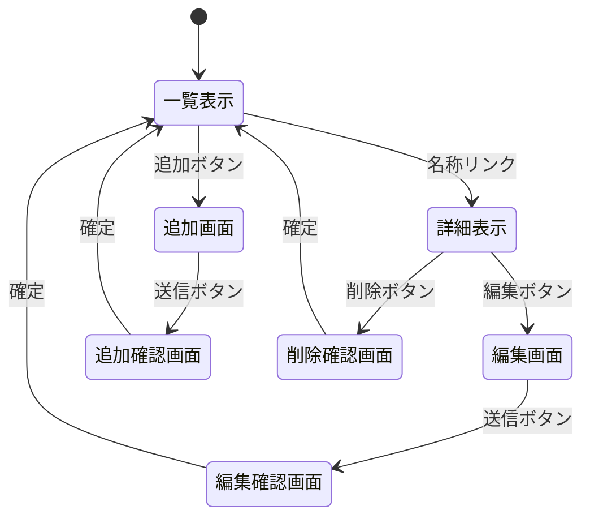

# 開発者用仕様書(仮)

## ・概要
ガンダムのネットミーム，ネタ集の一覧表示・管理アプリケーション

## ・データ構造
項目名 | 型 | 内容
-|-|-
id | 数値 | ID
meme | 文字列 | ネットミーム，ネタの名称
char | 文字列 | 主なキャラクター
original | 文字列 | 出展作品
detail | 文字列 | 詳細説明

## ・リソースごとの機能
リソース名: `/memes` (ネタデータ)

| 機能 | HTTPメソッド | URL | 処理内容 |
| - | - | - | - |
| 一覧表示 | GET | `/memes` | データ一覧を表示 |
| 詳細表示 | GET | `/memes/:id` | 指定IDの詳細を表示 |
| 追加画面 | GET | `/memes/create` | 新規登録フォームを表示 |
| 編集画面 | GET | `/memes/edit/:id`| 編集フォームを表示 |
| 更新処理 | POST | `/memes/update/:id`| データを更新 |
| 削除確認 | GET | `/memes/delete_confirm/:id` | 削除確認画面を表示 |
| 削除処理 | POST | `/memes/delete/:id`| データを削除 |

## ・ページ遷移とUI操作
一覧表示の画面から詳細表示，追加へのページに移動する．詳細表示からは編集と削除を行うことができる．

* **一覧 → 詳細**: リスト内の「名称」リンクをクリック。
* **一覧 → 追加**: 「新規追加」ボタンをクリック。
* **詳細 → 編集**: 「編集」ボタンをクリック。
* **詳細 → 削除**: 「削除」ボタンをクリック。

