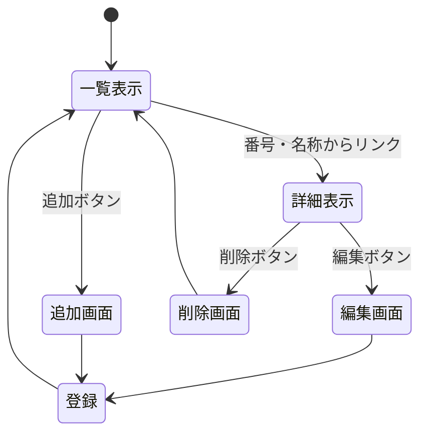
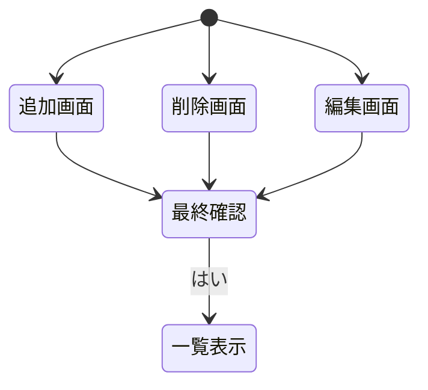

# 開発者用仕様書(仮)
## ・概要
ガンダムのネットミーム，ネタ集の一覧表示
## ・データ構造
項目名 | 型 | 内容
-|-|-
No.|数値|番号
meme|文字列|ネットミーム，ネタの名称
char|文字列|主なキャラクター
original|文字列|出展作品
detail|文字列|詳細

## ・ページ遷移
一覧表示の画面から詳細表示，追加へのページに移動する．詳細表示からは編集と削除の編集を行うことができる．追加画面からは要素を追加することができる．

### ・追加・削除・編集後に表示する内容
追加，削除，編集後にそれぞれ最終確認を促す画面を表示する．その後一覧表示に戻る．

## ・リソースごとの機能の詳細
